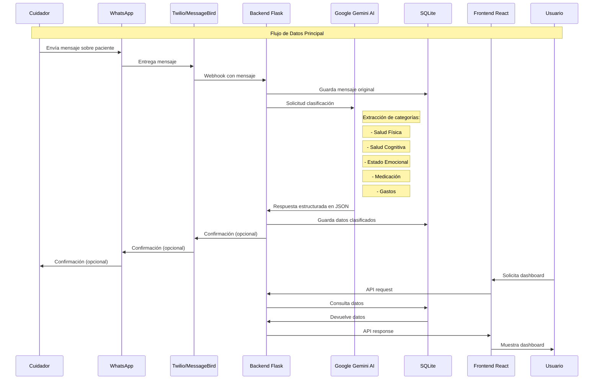

# Flujo de Datos de Serena MVP

Este documento describe en detalle el flujo completo de datos en el sistema Serena desde la entrada de un mensaje hasta su visualización en el dashboard.

## Diagrama de Secuencia



## Etapas del Flujo de Datos

### 1. Recepción del Mensaje

1. **Entrada del Mensaje**:
   - El cuidador envía un mensaje de texto informal a través de WhatsApp
   - Ejemplo: "Hoy María estuvo un poco mejor. Caminó unos 100 pasos hasta el jardín y comió bien el almuerzo. Sigue olvidando tomar su medicamento para la presión, tuve que recordárselo tres veces. Gastamos 45€ en medicinas."

2. **Procesamiento Webhook**:
   - Twilio/MessageBird recibe el mensaje y lo envía al webhook configurado
   - El backend Flask recibe el mensaje a través del endpoint `/api/webhook/whatsapp`
   - Se extrae el número de teléfono del cuidador, el texto del mensaje y la fecha/hora

3. **Identificación del Cuidador y Paciente**:
   - El sistema identifica al cuidador basado en el número de WhatsApp
   - Se determina el paciente asociado al cuidador
   - Si el cuidador no está registrado, se guarda el mensaje pero se marca para revisión manual

### 2. Clasificación del Mensaje

1. **Preprocesamiento**:
   - El mensaje se limpia de caracteres especiales y emojis innecesarios
   - Se normaliza el texto (minúsculas, acentos, etc.)

2. **Solicitud a Google Gemini AI**:
   - Se envía el mensaje normalizado a la API de Gemini
   - Se utiliza un prompt específico que define las categorías y subcategorías para clasificación

3. **Procesamiento por IA**:
   - Gemini analiza el texto y extrae información relevante
   - Clasifica la información en categorías predefinidas
   - Asigna niveles de confianza a cada clasificación

4. **Respuesta Estructurada**:
   - La IA devuelve un objeto JSON estructurado
   - Ejemplo de formato:
   ```json
   {
       "categorias": [
           {
               "nombre": "Salud Física",
               "detectada": true,
               "subcategorias": [
                   {
                       "nombre": "Movilidad",
                       "detectada": true,
                       "valor": "Caminó unos 100 pasos hasta el jardín",
                       "confianza": 0.95
                   },
                   {
                       "nombre": "Alimentación",
                       "detectada": true,
                       "valor": "Comió bien el almuerzo",
                       "confianza": 0.90
                   }
               ]
           },
           // Otras categorías...
       ],
       "resumen": "María mostró mejoría en movilidad y alimentación, pero continúa con problemas de adherencia a medicación."
   }
   ```

### 3. Almacenamiento de Datos

1. **Guardado del Mensaje Original**:
   - Se almacena el mensaje completo original en la colección `Mensajes`
   - Se registra el ID del cuidador, ID del paciente y fecha/hora

2. **Guardado de Datos Clasificados**:
   - Se itera sobre las categorías y subcategorías detectadas
   - Para cada elemento relevante, se crea un registro en la colección `DatosClasificados`
   - Se vincula cada dato con el mensaje original y el paciente

3. **Confirmación al Cuidador (Opcional)**:
   - Si está habilitado, se envía un mensaje de confirmación al cuidador
   - Puede incluir un breve resumen de la información registrada

### 4. Consulta y Visualización

1. **Petición de Dashboard**:
   - El usuario (familiar o profesional) accede al frontend
   - Después de autenticarse, solicita ver el dashboard de un paciente específico

2. **Recuperación de Datos**:
   - El frontend hace peticiones API al backend para obtener datos
   - El backend consulta MongoDB para obtener los datos clasificados
   - Se pueden aplicar filtros por categoría, fecha o período

3. **Procesamiento para Visualización**:
   - Los datos se agregan y procesan según las necesidades de visualización
   - Se calculan tendencias, promedios o cambios significativos

4. **Presentación en Dashboard**:
   - Los datos se muestran en componentes visuales (gráficos, tablas, indicadores)
   - Se destacan valores fuera de rangos normales o cambios importantes
   - Se proporciona acceso a los mensajes originales para contexto